#### Identity Protection
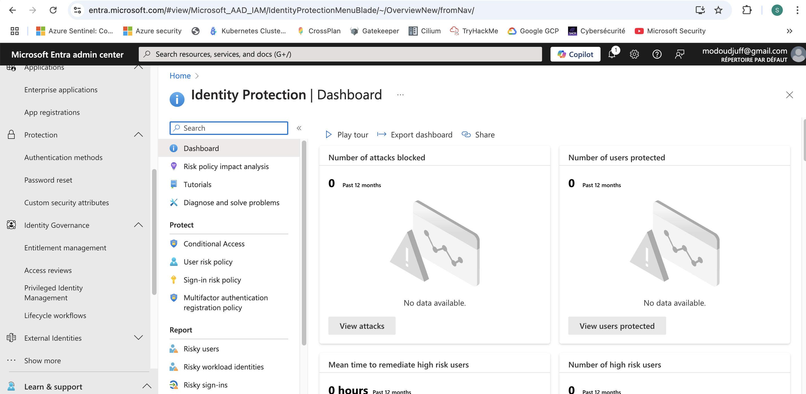
1. Sign-in risk (risque de connexion)
Analyse chaque connexion avec l'IA pour detecter les comportements inhabituel. La configuration se fait à 3 niveaux
- User Risque (Niveau de risque): High, Medium, Above, Low
  1. High: Users sign in with leaked credentials
  2. Meduim: Sign-in from anonymous IP, Sign in from infected device, Sign in from IP address with suspicious activites, Sign in from unfamaliar location, Impossible travel to atypical location (connexion dépuis deux endroits éloignés en peu de temps)

- Assignments: All users (some users)
- Actions (Control)
  1. Block access sign in
  2. Allow access sign in, and required MFA

2. User risk (risque utilisateur)
Une analyser base sur le comportement global de l'utilisateur au fil du temps pour detecter si le compte est compromis
- User risque: High, Medium, Above, Low
- Assignment: All Users
- Actions (control)
  1. Block access
  2. Allow access, and require change password

3. MFA Authentication registration policy
Politique pour exiger tous les utilisateurs à utiliser MFA. Les utilisateurs peuvent bypasser cette politique 14 jours après l'activation. Mais Au dele de cette date, il devient obligatoire pour eux d'activer le MFA pour accèder aux ressources azure. 
- Assignment: All Users
- Control (Actions): Require MFA authentication registration

#### MFA
Il existe deux façons de configurer MFA. Per-user MFA et Conditionnal Access MFA
NB: Microsoft Azure, recommande d'utiliser MFA avec accès conditionnel. 
1. [Per-User](https://learn.microsoft.com/en-us/entra/identity/authentication/howto-mfa-userstates)
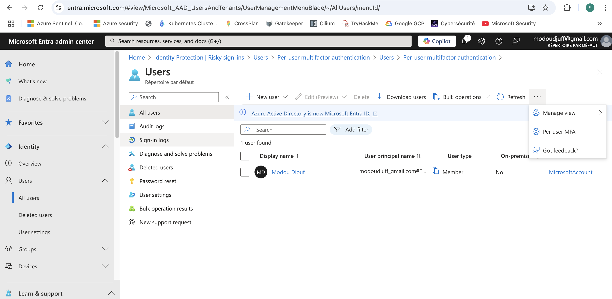
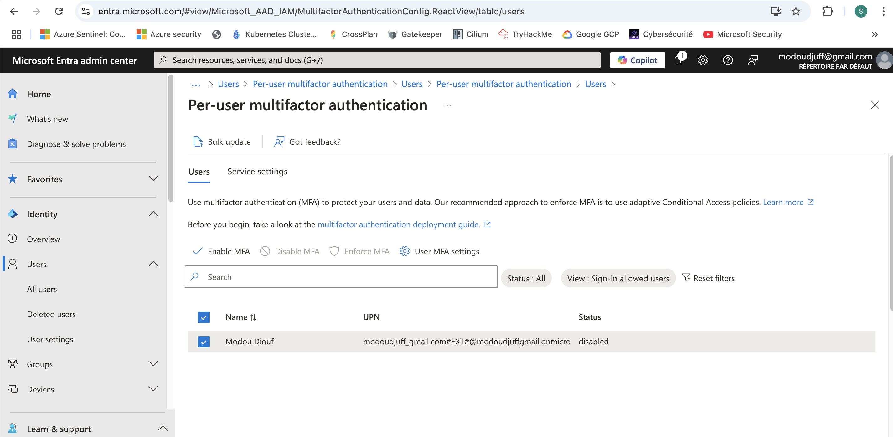
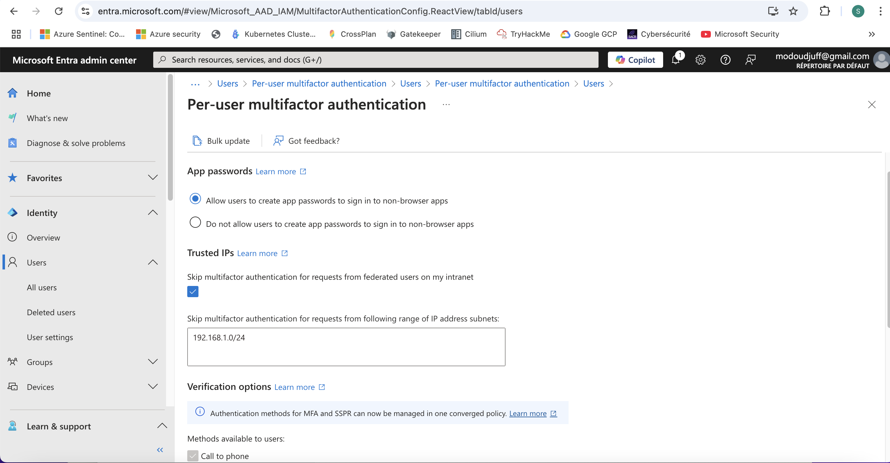
- Approche: Activer la MFA manuellement pour chaque utilisateur
- Avantages: 
  1. Simple à configurer pour un petit nombre d'utilisateurs
  2. Sécurise toutes les connexions, sans exception
- Inconvénients:
  1. Manque de flexibilité, MFA s'applique tout le temps meme sur des connexions sécurisées(si une CIDR n'est pas exclu).
  2. Expérience utilisateurs moins fluide, MFA systèmatique peut etre pénible. 
  3. Compliquer lorqu'on a plusieurs utilisateurs.
2. [Conditionnal-Access](https://learn.microsoft.com/en-us/entra/id-protection/howto-identity-protection-configure-mfa-policy)
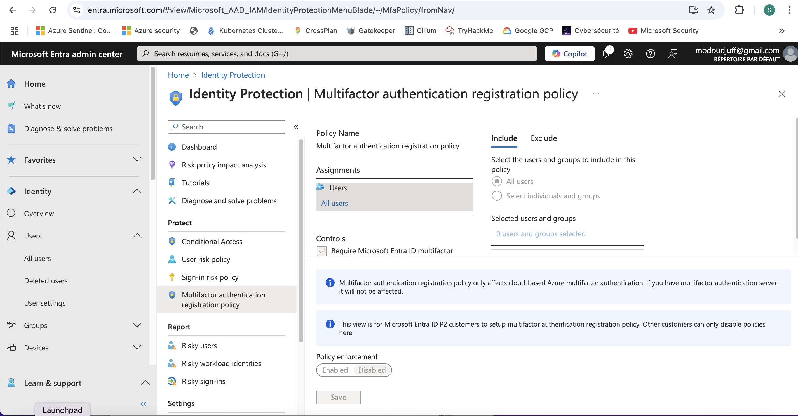
- Approche: Appliquer la MFA automatiquement selon des règles dynamiques
- Avantages: 
  1. MFA est exigé uniquement si l'utilisateur se connecte depuis un nouvel apparail, ou si un risque est détecté. 
  2. MFA n'est pas exigé si l'utilisateur est sur un réseau sécurisé, réseau de confiance.
  3. Plus flexible, MFA s'active uniquement en cas de besoin.
  4. Meilleur expérience utilisateur, pas besoin de demander MFA inutilement. 
  5. Plus sécurisé, MFA avec accès conditionel peut etre associé à des risques comme sign-in risk, user risk
- Inconvénients:
  1. MFA avec accès conditionel nécessite une licence P1 ou P2
  2. Une configuration plus complexe.

3. [App-Authenticator](https://support.microsoft.com/fr-fr/account-billing/comment-ajouter-vos-comptes-%C3%A0-microsoft-authenticator-92544b53-7706-4581-a142-30344a2a2a57) Configure Microsoft Authenticator pour le MFA

#### Conditional Access
#### Device Compliance
#### Identiy Governance
PIM et Access reviews sont les deux principales fonctionnalités de la gouvernance des identités.
1. PIM, configurer l'attribution de role temporaire. 
- Configuration PIMS
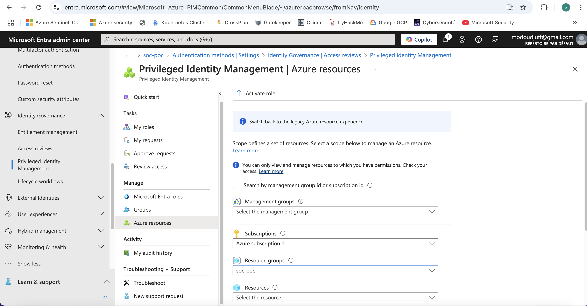
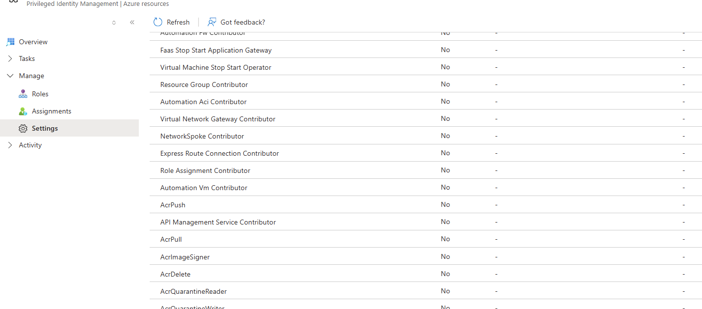
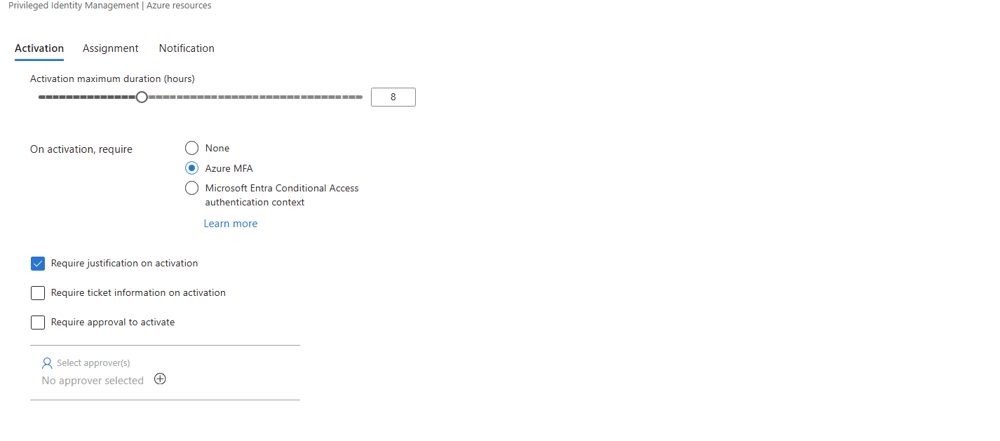
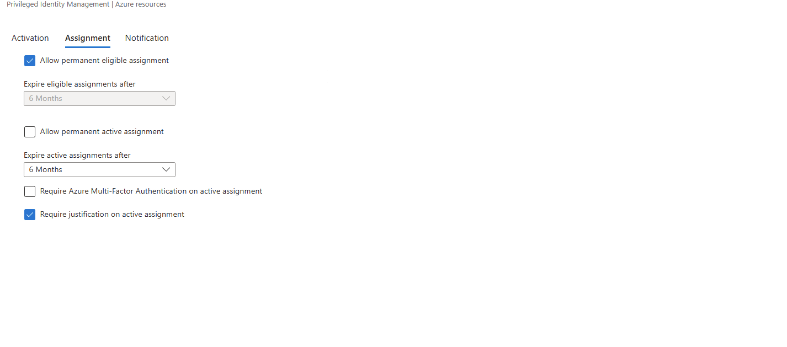
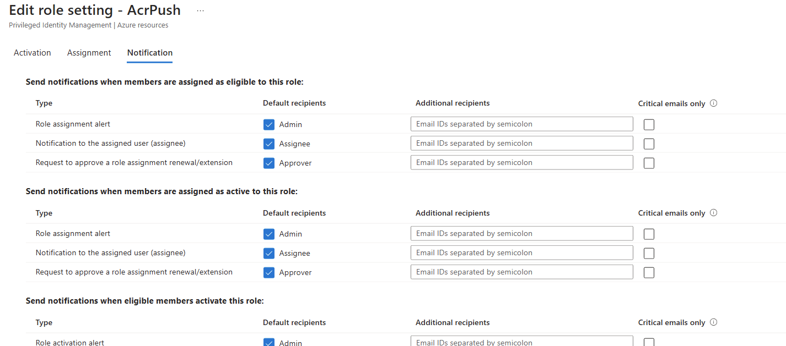
- Assigner le role à un utilisateur
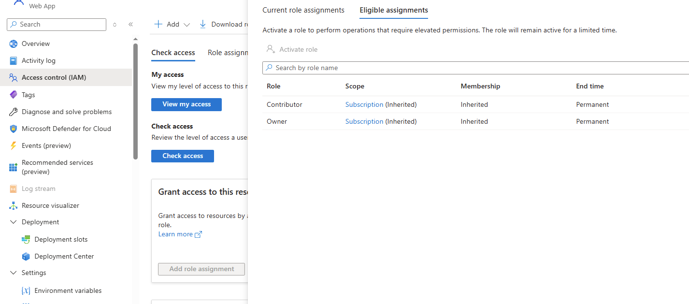
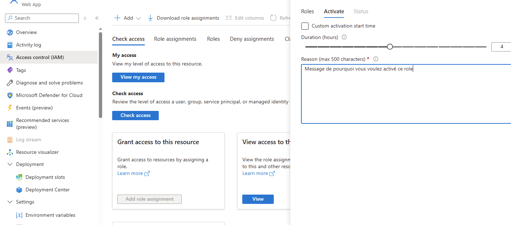
